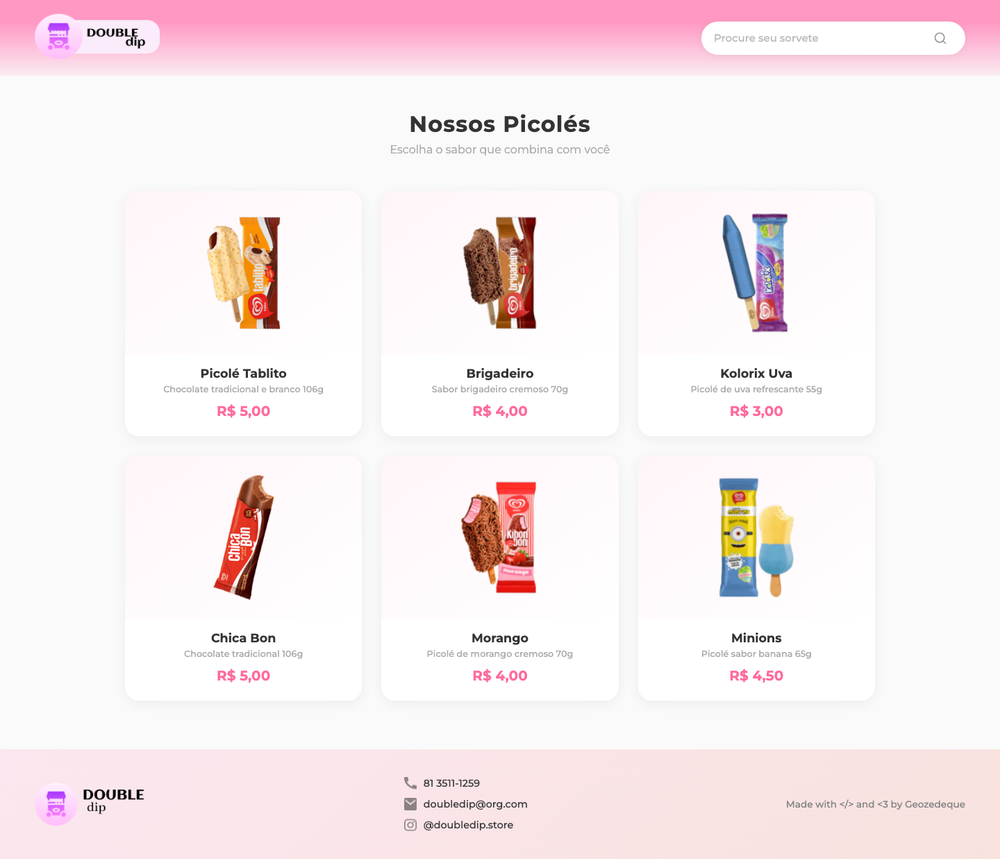
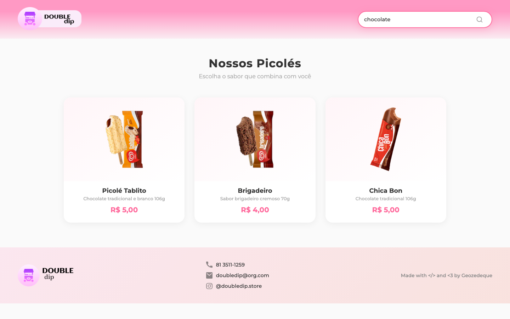
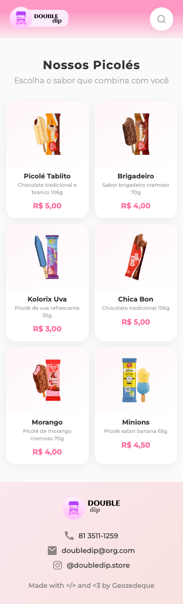
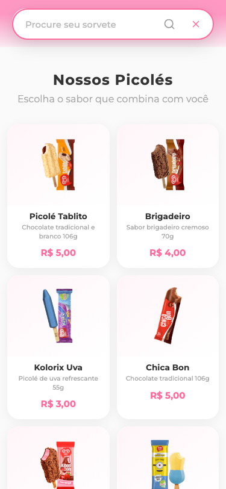

# Double Dip - Sorvetes e Picolés

Site de uma sorveteria fictícia, desenvolvido com HTML, CSS e JavaScript puro.

## Preview

### Desktop


### Busca funcional - filtra produtos em tempo real


### Mobile com busca expandida
<p align="center">
  
  &nbsp;&nbsp;&nbsp;
  
</p>

## Funcionalidades

- Busca funcional que filtra produtos em tempo real por nome ou sabor
- Barra de pesquisa expansível no mobile (toque no ícone para abrir)
- Mensagem "Nenhum picolé encontrado" quando não há resultado
- Layout responsivo (desktop, tablet e mobile)
- Cards de produtos com hover animado (elevação e zoom)
- Menu sticky que acompanha o scroll
- Gradientes suaves no header e footer

## Tecnologias

- HTML5
- CSS3 (Grid, Flexbox, Media Queries, Gradientes, Transições)
- JavaScript (filtro de busca, toggle mobile)
- Google Fonts (Montserrat)

## Estrutura

```
double-dip/
├── index.html
├── style.css
├── imagens/
│   ├── Component 1.png
│   ├── Component 2.png
│   ├── food-stand 1.png
│   ├── telefone.png
│   ├── email.png
│   ├── insta.png
│   └── ... (imagens dos picolés)
└── screenshots/
```

## Como rodar

Basta abrir o `index.html` no navegador.
