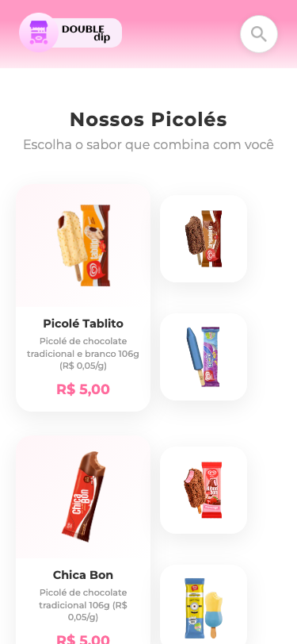

# Double Dip - Sorvetes e Picolés

Site de uma sorveteria fictícia, desenvolvido com HTML, CSS e JavaScript puro.

## Preview

### Desktop


### Mobile


## Funcionalidades

- Layout responsivo (desktop, tablet e mobile)
- Barra de pesquisa com animação de foco
- Cards de produtos com hover animado (elevação e zoom)
- Grid layout adaptável para diferentes tamanhos de tela
- Gradientes suaves no header e footer

## Tecnologias

- HTML5
- CSS3 (Flexbox, Grid, Media Queries, Gradientes, Transições)
- Google Fonts (Montserrat)

## Estrutura

```
desafioCiti_html-css/
├── index.html
├── style.css
├── imagens/
│   ├── Component 1.png
│   ├── Component 2.png
│   ├── food-stand 1.png
│   ├── Vector.png
│   ├── telefone.png
│   ├── email.png
│   ├── insta.png
│   └── ... (imagens dos picolés)
└── screenshots/
```

## Como rodar

Basta abrir o `index.html` no navegador.
