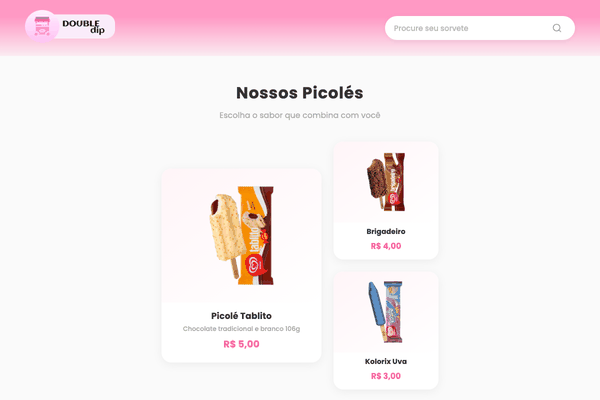

<div align="center">

# Double Dip - Sorvetes e Picolés

### Site de sorveteria fictícia — HTML + CSS + JavaScript

[](https://developer.mozilla.org/pt-BR/docs/Web/HTML)
[](https://developer.mozilla.org/pt-BR/docs/Web/CSS)
[](https://developer.mozilla.org/pt-BR/docs/Web/JavaScript)

</div>

---

## Demo

<div align="center">
  
</div>

---

## Sobre o Projeto

**Double Dip** é o site de uma sorveteria fictícia, desenvolvido com HTML, CSS e JavaScript puro. O projeto apresenta um cardápio de picolés e sorvetes com busca em tempo real, layout responsivo e visual colorido e convidativo.

---

## Funcionalidades

- **Busca em tempo real** — filtra produtos por nome ou sabor enquanto digita
- **Barra de pesquisa expansível no mobile** — toque no ícone para abrir
- **Mensagem de estado vazio** — exibe "Nenhum picolé encontrado" quando não há resultado
- **Layout responsivo** — desktop, tablet e mobile
- **Cards com hover animado** — elevação e zoom suaves
- **Menu sticky** — acompanha o scroll da página
- **Gradientes suaves** — no header e footer

---

## Tecnologias

- **HTML5** — estrutura semântica das páginas
- **CSS3** — Grid, Flexbox, Media Queries, Gradientes e Transições
- **JavaScript** — filtro de busca em tempo real e toggle da busca mobile
- **Google Fonts** — Montserrat

---

## Estrutura do Projeto

```
double-dip/
├── index.html
├── style.css
├── imagens/
│   ├── Component 1.png
│   ├── Component 2.png
│   ├── food-stand 1.png
│   ├── telefone.png
│   ├── email.png
│   ├── insta.png
│   └── ... (imagens dos picolés)
└── screenshots/
```

---

## Como Rodar

Basta abrir o `index.html` no navegador — sem dependências ou instalação necessária.

---

## Preview

### Desktop

<div align="center">
  
</div>

### Busca funcional — filtra produtos em tempo real

<div align="center">
  
</div>

### Mobile

<p align="center">
  
  &nbsp;&nbsp;&nbsp;
  
</p>

---

## Autor

<div align="center">

**Geozedeque Guimarães**

Estudante de Ciência da Computação — CIn-UFPE

[](https://github.com/GeozedequeGuimaraes)
[](https://linkedin.com/in/geozedeque-guimaraes)

</div>
